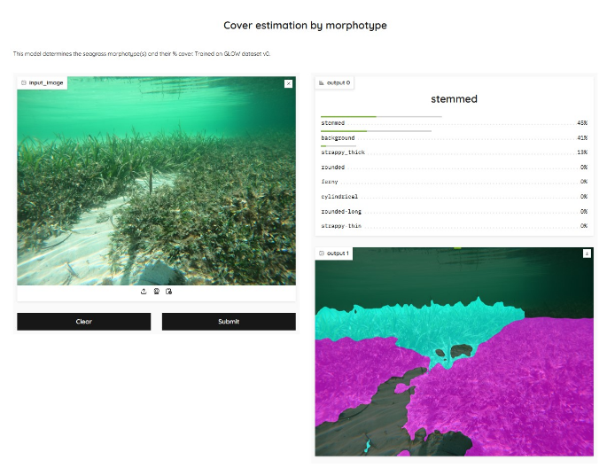
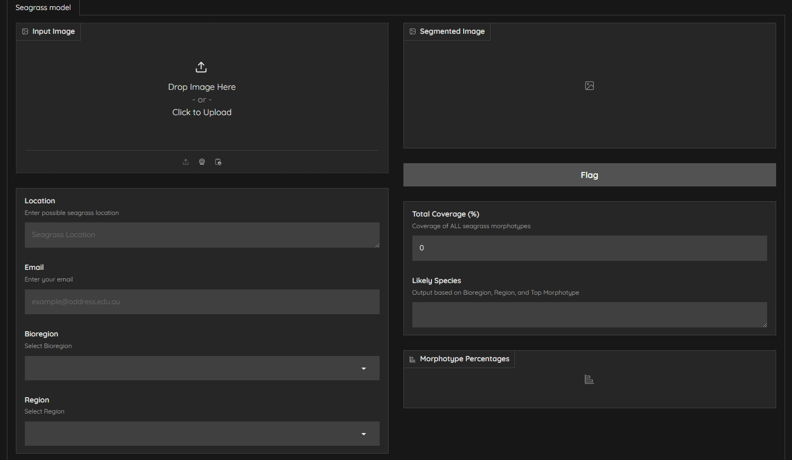

# Seagrassid Project
Web Application for Identifying Seagrass Types (GLOW) - Seagrassid is an innovative project focused on utilizing machine learning and image processing to identify and analyze seagrass ecosystems. I trained machine learning models, and assisted in deploying a web app solution using Docker, Nginx, and Nectar cloud servers.

## Try the App
<a href="seagrassid.org">Web Application</a> -> Try the App

| App                       | Work in Progress App                  |
|-----------------------------------|-------------------------------------|
|  |  |
